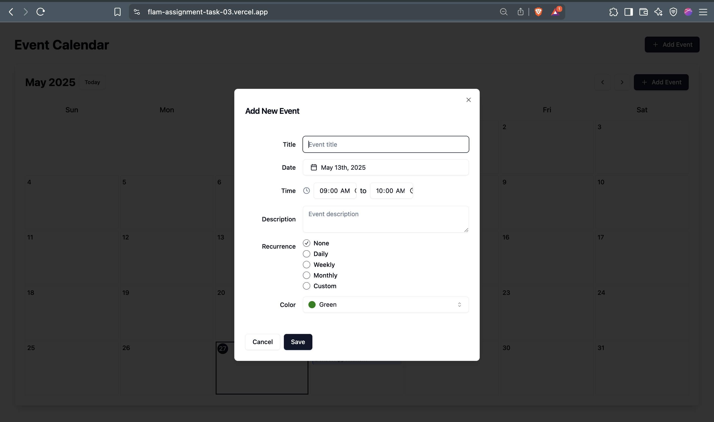

# 📅 Custom Event Calendar

A dynamic, interactive calendar application built with React that allows users to manage their schedule efficiently. Users can add, edit, delete, and view events—including support for recurring events and drag-and-drop rescheduling.

## 🚀 Live Demo

[Click here to view the live demo]( https://flam-assignment-task-03.vercel.app/)

---

## 🛠 Features

### ✅ Monthly View Calendar
- Traditional monthly calendar layout
- Highlights current day
- Navigation between months

### ✅ Event Management
- Add, edit, and delete events via a modal form
- Event details include title, date/time, description, recurrence, and color/category

### ✅ Recurring Events
- Supports daily, weekly, monthly, and custom recurrence patterns
- Recurring events are rendered on all applicable days

### ✅ Drag-and-Drop Rescheduling
- Drag events to different days
- Handles conflicts and overlapping scenarios

### ✅ Event Conflict Management
- Detects overlapping events
- Provides user feedback for conflicts


---

## 📦 Tech Stack

- **Framework:** React
- **State Management:** React Context 
- **Persistence:** Local Storage
- **Styling:** Tailwind CSS 

---

## 🧩 Getting Started

### Prerequisites

- Node.js (v16 or above recommended)
- npm or yarn

### Install and run application locally

```bash
git clone https://github.com/chanduv2017/flam-assignment-task-03
cd flam-assignment-task-03
npm install  # or yarn install
npm run dev

```
## 📸 Screenshots

### 🗓 Monthly Calendar View


### 📝 Event Creation Form


### 🔁 populated Calendar view


